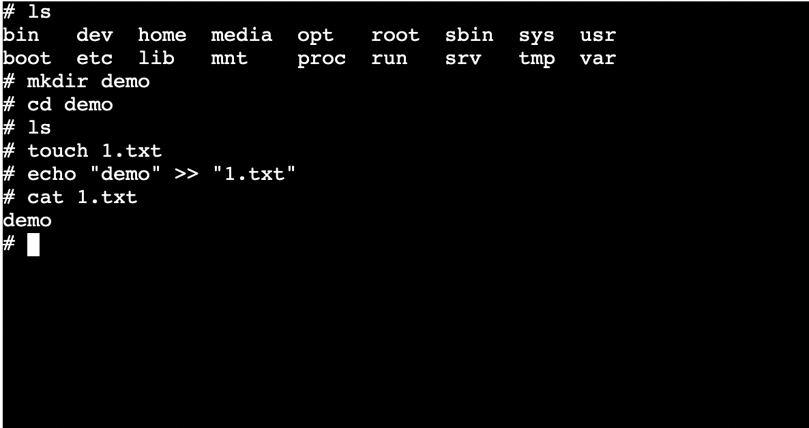

# sandbox
> + Sandbox can compile and run code in Docker and return the results
> + Sandbox can also get docker stream and with Xterm can quickly build a web version of the terminal

## quick start
> clone this repository
> cd ./docker && sudo sh ./install.sh
> cd .. && yarn && cd ./example/runcode && node index.js

## example
_Compile the NodeJS code_

``` javascript
const sandbox = require("./index");
sandbox.runJs(`console.log("hello,world")`)
```
> More language versions can be found in *[this](./example/runcode)*.

_get Docker container's Stream_
``` javascript
sandboxs.getSandbox().then(sandbox => {
        sandbox.getCmdStream().then(stream => {
            stream.on('data', (chunk) => {
                console.log(chunk.toString())// docker output data
            });
            stream.write(data); // write data to docker
            // such as :
            // stream.write("ls /n")
            // then docker will output someInfo
        })
    });
```
> A web terminal example built with xterm and socketIO can be found at  *[this](./example/cmdStreamWithXterm)*.
> 